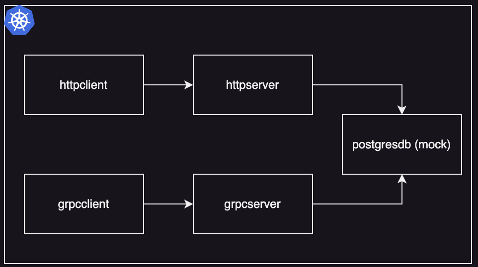
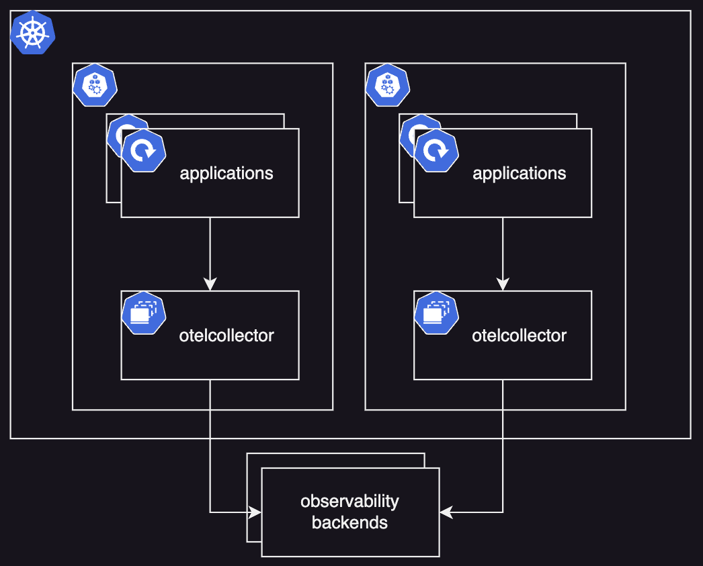

# Monitoring applications with OpenTelemetry

## Introduction

This repo is dedicated to show how to instrument applications with OpenTelemetry and monitor them with various backends. There are 4 applications:

- `httpclient`
- `httpserver`
- `grpcclient`
- `grpcserver`

## Prerequisites

- Docker runtime
- Helm 3
- Go SDK 1.21 (optional)

## Architecture

### Business flow



The client applications are making 3 sort of requests to their corresponding servers: `store`, `list` and `delete`. The servers will then go to the necessary tables on the mock Postgres DB and execute the relevant requests.

Eventually, we will have a service map with 3 components per request which we would like to monitor with various observability backends.

### Telemetry flow



In terms of telemetry, we have 3 types: `metrics`, `traces` and `logs`. In our setup, the applications will be sending their metrics and traces directly to the OpenTelemetry collectors per the OTLP protocol. For that, we will be using the `otlpreceiver` of the collector. On the other hand, they will be enriching their logs with the trace context and will simply stdout them. Using the `filelogreceiver`, the collectors will watch the application log files on the nodes and process them.

#### Code structure

The actual business logic is implemented within the common package. Each application basically refers to the same methods but just wraps their relevant protocols around them to communicate with each other.

The instrumentation is defined centrally in the commons package as well. The applications refer to the same instrumentation methods, though the names of their metrics and some attributes of their traces differ depending on the protocol they use to talk to each other.

## Running the environment

### Building & pushing the Docker images

This part is optional. The necessary images already exist publicly on the Github Container Registry. However, if you would like to change some part of the code to test some stuff out or if you’d like to contribute to this repository, here is how you can build and push your own images.

The folder structure is built in a way that every Docker image for any application can be built with one `Dockerfile` for amd64 or arm64 platforms. The script [`build_and_push.sh`](apps/build_push_local.sh) takes care of the process.

**Important note:** The protos must be generated for the GRPC applications! To do that switch to the relevant app directory (where the `go.mod` is) and run `go generate ./cmd/main.go`. Then you can build the images.

In order to push your own images, you need to be logged in to your preferred container registry. Github Container Registry is **NOT** a must. The `build_and_push.sh` also takes care of pushing the images to your registry including their platform (amd64 or arm64). Just define them per the script arguments.

```bash
bash build_and_push.sh \
  --registry <YOUR_REGISTRY> \
  --username <YOUR_USERNAME> \
  --platform <YOUR_PLATFORM>
```

### Creating a kind cluster

Theoretically speaking, you can use any Kubernetes cluster. In order to have the maximum value out of the repo, I would suggest that you use a multi-node cluster. It’ll make debugging more complex which we’ll tackle in the monitoring section.

In this repo, you can find a kind cluster creating script ([`deploy_cluster.sh`](infra/kind/scripts/deploy_cluster.sh)). Simply run the script and it will create a 1 control-plane and 3 worker noded cluster for ya.

### Deploying the applications

Under the helm directory, you can find all the necessary charts with their default values. You can run the [`deploy.sh`](infra/helm/deploy.sh) script to deploy all the relevant components for this repo.

If you want to simply deploy default version of the apps, run the script without any arguments:

```bash
bash deploy.sh
```

If you have built and pushed your own images, then run:

```bash
bash deploy.sh \
  --registry <YOUR_REGISTRY> \
  --username <YOUR_USERNAME>
```

## Monitoring the environment

### Generating intentional issues

There are multiple issues built into the applications with which you can affect the application performance which can be found under the Helm `values.yaml` of the applications. You can enable them, re-deploy the necessary apps and try to troubleshoot using your preferred observability backend.

#### Method delayed

All applications have the individual flags `config.storeDelay`, `config.listDelay` and `config.deleteDelay`. If you enable this, the applications will execute the relevant methods longer than usual.

#### Database not reachable

Both `httpserver` and `grpcserver` have the flag `config.createDbNotReachableError`. If you enable this, the applications will get an error during their calls to the database.

#### Postprocessing failed

Both `httpclient` and `grpcclient` have the flag `config.createPostprocessingError`. If you enable this, the applications will generate an error during the postprocessing phase.

#### Postprocessing delayed

Both `httpclient` and `grpcclient` have the flag `config.createPostprocessingDelay`. If you enable this, the applications will execute the postprocessing step a lot longer than usual.

### Observability backends

- [OSS](monitoring/oss/README.md) (Prometheus, Tempo, Loki, Grafana)
